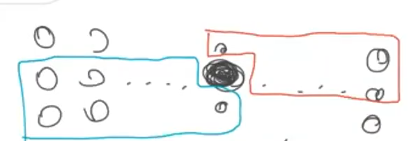

## GCD
Lemma. $euclid(F_{k+2}, F_{k+1})$ makes $k$ iterations for $k \geq 2$

Lemma. Suppose $a \geq b \geq 2$ and $euclid(a, b)$ performs $k$ iterations.
Then $a \geq F_{k+2}$ and $b \geq F_{k+1}$.

Theorem. If $k>6$ then $F_k \geq 2 ^ {k / 2}$.

Theorem. Let $a \geq b \geq 1$ and suppose $b$ is an $n-bit$ number. Then
$euclid(a, b)$ performs at most $2n$ operations.

Theorem. If $a$ and $b$ are integers with at most $n$ bits, then
$euclid(a, b)$ performs at most $O(n^2)$ steps.

Theorem. $F_n \geq \frac 13 \varphi^n$ for $n \geq 1$

Multiplication: Karatsuba algorithm
$$x \cdot y = (A 2 ^ {n / 2} + B) (C 2 ^ {n / 2} + D) = (AC)2^n + (AC + BC) 2 ^ {n / 2} + BD $$
$\Theta(3 ^ d) = \Theta(n ^ {\log_23})$

## Sortings
Merge Sort : $n \log_2(n) - n + 1$ comparisons

Quick Sort : $2nH_n + 2H_n - 4n = 2n\ln(n) + O(n) = 1.39n \log_2(n) + O(n)$ 

$$\mathbb E[A_{i, j}] = \frac 1 {|i - j| + 1}$$
$$\mathbb E[\#comparisons] = \mathbb E_{i \neq j}[A_{i, j}] =2 \sum_{1 \leq i \leq n - 1} (1 + 1/2 + \cdots + 1/n)$$

## Median of median

$$T(n) \leq 2n + T(n / 5) + n + T(\frac7{10} n)$$
$T(n)$ 大约是 $30n$

## MST

Good: subset of $E$ of an MST

Cut Lemma. 两个 cut 之间的最短边是 good 的

证明：考虑加边

Prim Kruskal 正确性由 cut lemma

## UF Set
#### Merge by rank
The maximum rank is at most log(n) + 2. The maximum height is at most log(n). The operation find(x) takes O(log n) steps.
#### Merge by rank + PATH
see last pages of pdf

## Kirchhoff's Matrix Tree Theorem

等价于考虑一条边在不在生成树里的方式数数，用矩阵的方式表达。

实现：Akina 3-4
